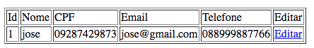
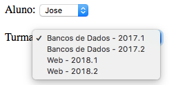

## Scriplets - JSP, EL e JSTL
### Exercício

Altere o sistema produzido no exercício 4 utilizando JSP, EL e JSTL, conforme os requisitos a seguir:

* Alterar a página de `alunos` para `alunos.jsp`: 
	* criar a tabela utilizando JSP e adicionar uma coluna para a opção `EDITAR` que leva a uma página de edição daquele aluno.
	* Dica: na coluna de `Editar` você pode colocar um link para um servlet passando como parâmetro o id do aluno a ser editado, e o servlet busca o aluno e repassar como atributo para uma página de edição (que contém um formulário semelhante ao de cadastro), conforme a imagem abaixo.

	

* Página de `turmas` deve ser `turmas.jsp`: 
	* criar a tabela utilizando JSTL e adicionar uma coluna para a opção REMOVER que atualiza a listagem das turmas.
	* Dica: na coluna de `Remover` você pode colocar um link para um servlet passando como parâmetro o código da turma ser removida.

* As funcionalidades das páginas de `matriculas` e `matricular` devem ficar todas na página de `matrículas`
	* Colocar o formulário de matrícula na parte superior da página
	* Os campos de texto referentes a `id do aluno` e `codigo da turma` devem ser substituídos por componentes HTML do tipo `select` (conforme a imagem abaixo). 
		* O campo aluno deve apresentar no `select` o nome do aluno
		* O campo turma deve apresentar no `select` o nome da disciplina e o período 
	
	

	* A listagem de matrículas deve estar abaixo do formulário de cadastro e deve ser feita utilzando JSTL.
	* Ao cadastrar uma matrícula, a página deve ser atualizada.
